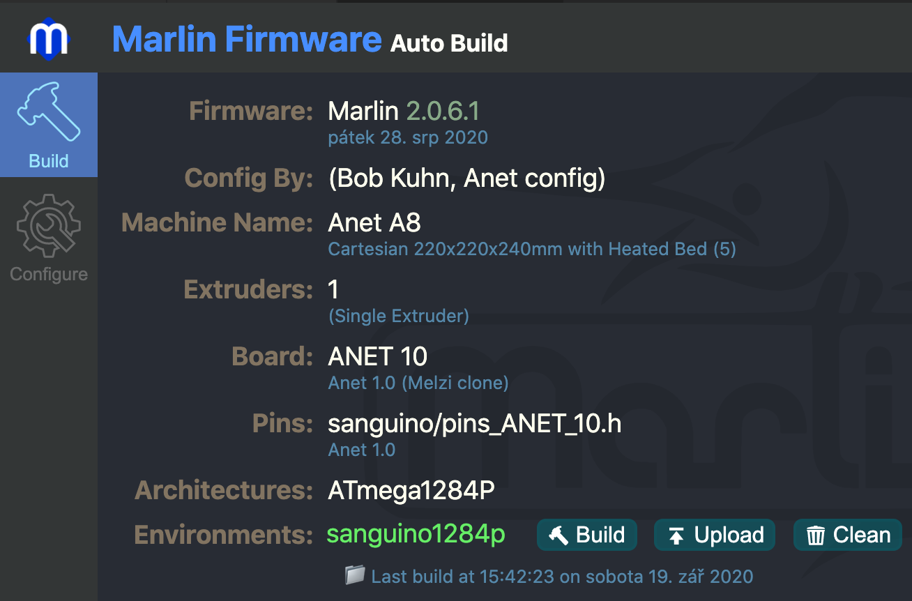
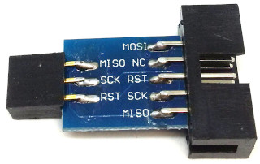
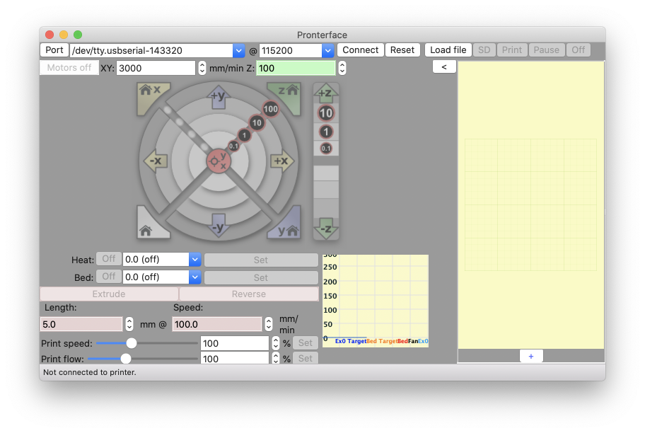

# 3d-print-etc

3D printing HW and SW with ephasis to debugging and troubleshooting.

## Building the printer Anet8

PDF: [The big troubleshooting guide v2](https://gr33nonline.files.wordpress.com/2017/05/the-big-troubleshooting-guide.pdf)

__Board - HW__

* Github: [ANET 3D Board v1.0](https://github.com/ralf-e/ANET-3D-Board-V1.0) - reverse engineered schematics
* RepRap: [Sanguinololu/AVR1284p](https://reprap.org/wiki/Sanguinololu#Schematic_.26_Board_Images) - this board is the Anet board based on.

Google search `Anet C43` (which is the number of capacitor/smoother for B_T ala bed termistor)

* [at Thingverse forum](https://www.thingiverse.com/groups/anet-a8-prusa-i3/forums/general/topic:17964)
* [at Redit.com](https://www.reddit.com/r/3Dprinting/comments/6hoxei/troubleshooting_anet_a8_mobo/)
* [at reprap.org forum](https://reprap.org/forum/read.php?406,758418)
* CZ: [3ddactory.cz blog](https://3dfactory.cz/2018/04/09/chybna-teplota-podlozky/)
* [at facebook.com/anet](https://www.facebook.com/groups/1068531466501015/permalink/2116665988354219/?comment_id=2116717085015776&reply_comment_id=2116719315015553)
* also the PDF: [The big troubleshooting guide v2](https://gr33nonline.files.wordpress.com/2017/05/the-big-troubleshooting-guide.pdf) mentions the capacitor issue

## Marlin for Anet

* [marlinfw.org](https://marlinfw.org/) - the alternative firmware compatible with Anet 8 Mainboard
* [MarlinFirmware/Marlin](https://github.com/MarlinFirmware/Marlin)
* [MarlinFirmware/Configurations](https://github.com/MarlinFirmware/Configurations) in particular [config/examples/Anet/A8](https://github.com/MarlinFirmware/Configurations/tree/import-2.0.x/config/examples/Anet/A8)

> __Note:__ the files from `config/examples/Anet/A8` have to go into `<Marlin-folder>/Marlin` overwriting the existing ones. In order to quickly build them issue:

```bash
#!/bin/bash -x

pio run -e sanguino1284p "$@"
```

> __Note:__ you can use the [Visual studio code](https://code.visualstudio.com/) or [VSCodium](https://vscodium.com/) with plugins __PlatformIO IDE__ and eventually __Auto Build Marlin__. But I like the CLI which is neat and can be run even remotely.

For GUI lovers one screenshot that displays properly configured Marlin.



### Patching firmware

When you decide to replace some part of your printer by some (better) alternative. Then you in most case would have to update the `config.h` or `config_adv.h` that you have copied into Marlin source root folder.

### Flashing firmware

The best and the safest way is to use `usbasp` (or its clone) to write firmware via __J1__ connector which is SPI capable of ISP programming (it has RST pin).

|USB ID   |Device
|---------|------
|1a86:7523| Anet A8 itself via USB cable
|16c0:05dc| Proper USBASP programmer

Optional but recomended, backup your firmware:

```bash
$AVRDUDE -c usbasp -p m1284p -P usb -U flash:r:$BACKUP -C $AVRDUDE_CONF
```

The flash the new firmware:

> __Note:__ when using USPASP like from [atnel.pl](https://atnel.pl/EN/atb-usbasp-programmer.html) based on original [Fischl design](https://www.fischl.de/usbasp/). You have to use special cable the 2x5 ribbon cable that CANNOT be used as-is. You have to either make a new cable (2x5->2x3, see the [link to schematics](https://github.com/ralf-e/ANET-3D-Board-V1.0)) or use the 2x5->2x3 adapter (see [hints](https://uptanium.org/Firmware-Snapshot-A8.html)). Eventually you could also user the Arduino as ISP programmer sketch, but my favourite is the USBASP.



```bash
$AVRDUDE -v -p m1284p -C $AVRDUDE_CONF -c usbasp -U flash:w:$FW:i
```

the firmare file (.HEX) is built in `<Marlin-folder>/.pio/build/sanguino1284p/firmware.hex` folder (or `just find . -name firmware.hex`).

```bash
AVRDUDE=$HOME/.platformio/packages/tool-avrdude/bin/avrdude
AVRDUDE_CONF=$HOME/.platformio/packages/tool-avrdude/avrdude.conf
BACKUP=$PWD/backup.hex
```

## The firmware alternatives

* [Marlin](https://marlinfw.org/) - well known firmware
* [Repetier-Firmware](https://www.repetier.com/documentation/repetier-firmware/) - Reperier Host, Server and Firmware
* [RepRap Firmware](https://reprap.org/wiki/RepRap_Firmware) - the grand father of 3D printers
* [Smoothieware](http://smoothieware.org/howitworks) - own board, v1 and v2, both 32-bit
* [Teacup](https://www.reprap.org/wiki/Teacup_Firmware) - from the RepRap comunity
* [Klipper](https://www.klipper3d.org/) - __combine power__ of host computer with the MCU (see [Step Benchmarks](https://www.klipper3d.org/Features.html#step-benchmarks))
* [Redeem](https://github.com/intelligent-agent/redeem) - BeagleBone (?black)

## The boards

[at Marlin](https://marlinfw.org/docs/hardware/boards.html)

[Best 5 @ all3dp.com](https://all3dp.com/2/5-fantastic-3d-printer-controller-boards/)

* Smoothieboard - Ethernet
* Panucatt Azteeg X5 GT - 32bit ARM
* Duet WiFi - TMC with WiFI, ATMEL SAM4E8E
* Revolve (preview) - __1 GHz__ CPU
* Panucatt Azteeg X3 Pro - __8 axis__

### General CPUs

* AVR based
	* ATMega1284 - 124KB flash, 4K ram (Sanguinololu)
	* ATMega2560 - 256KB flash, 8K ram (Ramps)
* 32-bit ARM
	* Atmel SAM
		* Panucatt
	* NXP LPC - Cortex M4
		* (Smoothieboard](http://smoothieware.org/smoothieboard)
	* STM32
		* Big Tree tech
		* [Rumba32](https://github.com/Aus3D/RUMBA32) and [Rumba32 @ RepRap](https://reprap.org/wiki/Rumba32)

### Big Tree tech

* [SKR Pro v1.1](https://github.com/bigtreetech/BIGTREETECH-SKR-PRO-V1.1)
* [SKR Mini E3](https://github.com/bigtreetech/BIGTREETECH-SKR-mini-E3)
* [BTT shop](http://www.bigtree-tech.com/shop)

They have many addons like displays, extension boards and even printer parts other then these boards (i.e.extruder).

## Proterface

[Proterface Home](https://www.pronterface.com/) - tool for moving the printer around
[Pronterface Github](https://github.com/kliment/Printrun) - clone and run

```bash
# create the python virtual interface
virtualenv -p python3 ~/venv3
# activate the virtual env
source ~/venv3/bin/activate

# download the latest sources
git clone https://github.com/kliment/Printrun.git
cd Printrun

# check available tags or branches
git tag
# (optional) checkout the one you want or just stay on master
git checkout printrun-1.6.0

# install required modules into the virtual environment
pip install -r requirements.txt

# and finally start the interface
python pronterface.py
```



## Calibrations

To make good prints you need some callibration. There is number of them. As recomended by the experienced users you should do:

1. Calibrate the x/z-axis, so the distance between the lead screws and smooth rods on both sides has to be __perfectly parallel__ otherwise the z-axis moves might in the worst case jam and cause skipped steps! In the best case it would do some anoyning noise. All that caused by non-parallel guides on z-axis. Yt:[Anet A8 - Solution for problems with Z axis stepper [Eng sub]](https://youtu.be/e7f-x3-mroI), Yt: [3D printer wobbling solved - mechanical improvement Geeetech prusa i3 mk8, Anet A8](https://youtu.be/G5XpvJxJVaQ), [Anet A8 Z-Axis alignment (Proper z-axis wobble fix and noice reduction)](https://youtu.be/Z8xEaJfzx4g).

2. Calibrate z/x-axis horizontality. This is a task to make sure that both z-axis drivers (Z1 and Z2) are running in sync. This cannot be ensured for 100% because we do not have closed loop steppers (like S42 from Steppers online) but can we can do our best to make sure they start at equal level and have no obstacles on their way.

3. Level the Heated Bed (see below for mesh tool with Octoprint)

4. Extrusion and retraction between prints and on start of print (preamble code)

5. Autoleveling with the Z-probe (mesh)

### Heat Bed  calibration

The tool: `ocmd.py`

After using the `Printrun/proconsole.py` CLI to move around I have relalized that there are some batches of commands that
[python/ocmd.py](https://github.com/PexMor/3d-print-etc/tree/master/python).

## References

Interesting software and tools to use during th whole model to print.

### 3D Modelers

* Autodesk: [Tinker CAD](https://www.tinkercad.com)
* Autodesk: [Fusion 360](https://www.autodesk.com/products/fusion-360/personal)
* [Solvespace](https://github.com/solvespace/solvespace) - 3D parametric modeling SW, last update 2016
* [FreeCAD](https://www.freecadweb.org/)
* [Blender](https://www.blender.org/)

### Slicers

* [CURA Ultimaker](https://ultimaker.com/software/ultimaker-cura)
* [Prusa Slic3r](https://github.com/prusa3d/PrusaSlicer/releases)

## Dict

|English|Czech
|-------|-----
|pitch|stoupání, vzdálenost mezi závity
|lead|vedení, lineární posun pro jednu otáčku závitu
|[lead screw](https://en.wikipedia.org/wiki/Leadscrew)|vodící či pohybový šroub (často trapézový nebo [kuličkový](https://cs.wikipedia.org/wiki/Kuli%C4%8Dkov%C3%BD_%C5%A1roub))
|[ball screw](https://en.wikipedia.org/wiki/Ball_screw)|kuličkový šroub (druh vodícího šroubu s malou vůlí)
|[trapezoidal or acme thread](https://en.wikipedia.org/wiki/Trapezoidal_thread_form)|trapézový závit (používaný na trapézovém šroubu)

* [Pitch vs lead](https://www.thomsonlinear.com/en/support/tips/difference-between-screw-pitch-and-lead) - single, double, triple, four start

* [Acme or trapezoidal? What’s the difference between lead screw designs?](https://www.linearmotiontips.com/acme-or-trapezoidal-whats-the-difference-between-lead-screws-designs/)
* [What is a follower nut, and what role does it play in lead screw operation?](https://www.linearmotiontips.com/what-is-a-follower-nut-and-what-role-does-it-play-in-lead-screw-operation/)

* Thingverse: Temp tower [#1](https://www.thingiverse.com/thing:2493504), [#2](https://www.thingiverse.com/thing:2729076), [how to make your own](https://hobbyhoarder.net/temperature-tower/) or

[Other test prints](https://all3dp.com/2/3d-printer-test-print-10-best-3d-models-to-torture-your-3d-printer/):

* [3D Benchy](https://www.thingiverse.com/thing:763622)
* [All-In-One 3D Printer Test](https://www.thingiverse.com/thing:2656594/makes)
* [XYZ 20mm cube](https://www.thingiverse.com/thing:1278865)
* [Cali Cat – The Calibration Cat](https://www.thingiverse.com/thing:1545913)
* [MatterHackers' Mascot Phil A. Ment](https://www.thingiverse.com/thing:2557603)
* [Smart Compact Temperature Calibration Tower](https://www.thingiverse.com/thing:2729076)
* [Open-Source Printer Evaluation](https://github.com/kickstarter/kickstarter-autodesk-3d)
* [PolyPearl Tower](https://www.thingiverse.com/thing:2064029)
* [Ultrafast and Economical Stringing Test](https://www.thingiverse.com/thing:2219103)
* [Bed Leveling Calibration Test Object (Parametric)](https://www.thingiverse.com/thing:34558)

[see also - printer calibration basics](https://all3dp.com/2/how-to-calibrate-a-3d-printer-simply-explained/)

* YT: [Linear rails guide and test on Ender 3 and Ender 5](https://youtu.be/I3xMHjiYENk)
* YT: [Remove ringing by tuning acceleration and junction deviation - step by step guide](https://youtu.be/Mnvj6xCzikM)
* YT: [Should you be using IGUS polymer bushings?](https://youtu.be/ZGBipbgwgME)
* YT: [Complete linear rails conversion of CR-10 3d printer](https://youtu.be/pumRIHed8U0)
* YT: [Power screws](https://youtu.be/zgIPRXd0rBM) - Power Screws: Torque, Power, and Efficiency (ACME example)

* YT: [3D printing, what to use... BELTS or SCREWS ??](https://youtu.be/YU5SdzRVtv0)
* [Printing calculations](https://dyzedesign.com/2016/11/printing-300-mm-s-part-2-calculations/)
* [Stepper motor basics](https://www.geckodrive.com/support/step-motor-basics.html)


